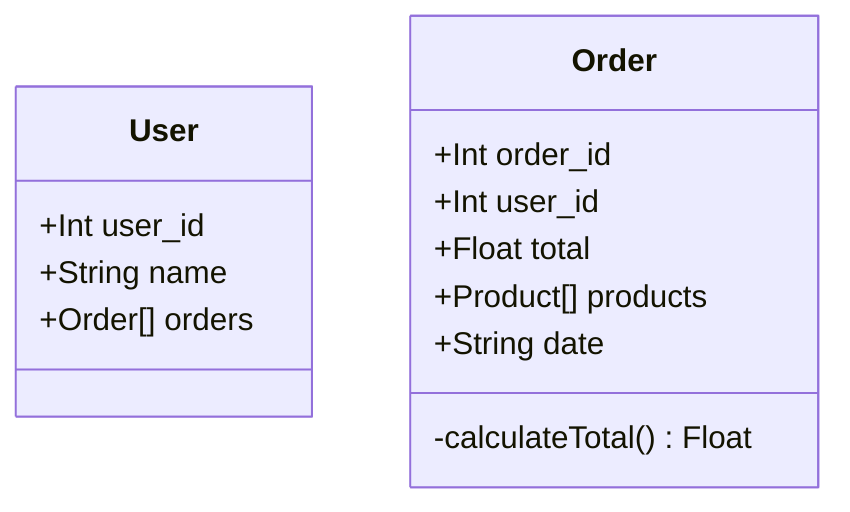

<h1 align="center"> Desafio Técnico - Luizalabs </h1>

Este repositório contém a minha solução para o **Desafio Técnico** da **Vertical de Logística** da **Luizalabs**. O contexto do desafio é a integração de um sistema legado que possui um arquivo de pedidos desnormalizados e precisamos transformá-lo em um *json* normalizado. Dessa forma, o desafio consistia em desenvolver em **NodeJS** uma **API REST** que receba um arquivo de texto em um formato específico, faça seu processamento e então disponibilize esses dados via **API REST**.

<br>

# Tecnologias

- **Typescript**
	- Sempre utilizo `Typescript` em meus projetos `NodeJS` pois acredito que ele facilita bastante o desenvolvimento e a manutenção do código, além de trazer mais segurança e reduzir consideravelmente os erros.
- **NestJS** 
	- A escolha do `NestJS` está relacionada tanto com a familiaridade que tenho com o *framework* quanto com as diversas vantagens que ele traz. O sistema de módulos do `NestJS` e a injeção de dependências automáticas auxiliam bastante na aplicação de conceitos da *Clean Architecture*.
- **Docker**
	-	Escolhi utilizar o `Docker` pois ele simplifica bastante a execução e distribuição da aplicação. Dessa forma consigo subir o código e não me preocupar com o ambiente de execução que outro usuário irá utilizar pois o `Docker` já ficará responsável por isso, além de subir o banco de dados e executar a aplicação.
- **Prisma**
	-  Escolhi utilizar o Prisma pois ele simplifica bastante o desenvolvimento e traz uma experiência muito melhor para o desenvolvedor se comparada com outros *ORMs*. Um motivo é o suporte nativo para *TypeScript*.
- **Multer**
	-  O `Multer` pareceu ser a escolha mais sólida para lidar com os arquivos que receberia nas requisições.

<br>

# Solução


### Primeiros passos:
Ao receber o desafio, meu primeiro passo foi realizar uma análise aprofundada, compreendendo o escopo do projeto e identificando as entidades envolvidas.

A partir dessa análise compreendi que o desafio consistia no desenvolvimento de uma *API REST* capaz de receber um arquivo de texto seguindo um padrão específico, processá-lo e, em seguida, disponibilizar os dados via *API REST*.

Inicialmente, surgiu a dúvida se deveria retornar o *JSON* normalizado no mesmo endpoint de envio do arquivo ou apenas disponibilizar os dados para consulta por meio da *API REST*. Optei por seguir o segundo caminho.

Geralmente inicio pela modelagem das entidades mas neste projeto estava curioso sobre como faria o processamento do arquivo de texto. Por esse motivo, decidi então realizar uma *POC* (*Proof of Concept*) pra ver como funcionaria e a solução que encontrei foi utilizar expressões regulares (*regex*) para fazer a validação desses registros. Utilizando *regex* consigo verificar se a linha do arquivo segue o padrão especificado e então consigo extrair em variáveis pré-definidas, facilitando a construção do objeto final.

Para o padrão definido no desafio foi utilizada a segunda expressão:

	/^(?<user_id>\d{10})(?<name>.{45})(?<order_id>\d{10})(?<product_id>\d{10})?(?<value>\s*\d{0,10}\.\d{1,2})(?<date>\d{8})$/

### Modelagem
Inicialmente identifiquei três entidades (Usuário, Pedido e Produto) porém durante a modelagem optei por criar apenas as entidades **Usuário** e **Pedido**. Uma das razões para essa escolha foi a constatação de que um mesmo produto (mesmo *product_id*) poderia ter preços distintos em diferentes pedidos.

Sendo assim, foram criadas as classes `User` e `Order` para representar as entidades `Usuário` e `Pedido`.



A classe entidade `User` possui os atributos `user_id`, `name` e `orders`. E a classe `Order` pussui os atributos `order_id`, `user_id`, `total`, `products` e `date` e o método privado `calculateTotal`, responsável pelo cálculo do total do pedido a partir dos valores dos produtos.


### Arquitetura

Desenvolvi esse projeto tentando aplicar alguns conceitos de **Clean Architecture**, separando as funcionalidades em camadas de acordo com a sua responsabilidade e isolando as regras de negócio, reduzindo o aclopamento entre os componentes do sistema. O **NestJS** auxiliou bastante nisso com sua estrutura de módulos e o suporte a injeção de dependências.

O fluxo da aplicação segue da seguinte maneira: uma requisição é recebida pelo controlador (*controller*), que, por sua vez, invoca o caso de uso correspondente. O caso de uso interage com a camada de persistência através da implementação do repositório associado à entidade, gerando uma resposta que retorna ao controlador.

Os *repositories* de **Order** e **User** definem os métodos que devem ser implementados. Nessa aplicação, a implementação é feita pelo **Prisma** na camada de *Infra*. O módulo *Database* define que implementação os *repositories* devem seguir. Dessa forma as outras camadas não precisam se "preocupar" com a implementação que está sendo feita, apenas chamam o método do *repository* enquanto o módulo *Database* define a implementação.

Isso exemplifica o desacoplamento na aplicação, permitindo a alteração da implementação do banco de dados ou *ORM* a qualquer momento, sem afetar outras camadas, desde que a interface definida na camada de domínio seja seguida.

<hr>


Voltando ao desenvolvimento da solução, outra questão que surgiu foi que, como esses arquivos já continham usuários e pedidos previamente cadastrados, eles já possuíam *user_id* e *order_id*. Consequentemente, ao cadastrar esses usuários a partir do arquivo, gerou um problema no **PostgreSQL**, que acabava perdendo a contagem do índice *autoincrement*. Como eram criados registros sem utilizar o índice padrão, essa variável do banco não era atualizada. Então, ao tentar gerar um novo registro sem informar o índice, o **PostgreSQL** tentaria utilizar o *index* desatualizado, o que acabava gerando erro.

Uma possível solução seria manter os *Ids* do sistema legado como um campo comum e, durante o cadastro, gerar um *UUID* para cada novo registro. Dado o contexto de um teste técnico, decidi buscar uma solução mais simples. Além disso, como a saída de dados já possuia um formato específicado, isso poderia gerar problemas na avaliação. Portanto, optei por preservar a estrutura existente.

A abordagem que adotei foi criar um método foi criação de um método que deve ser chamado ao gerar um novo registro com *id* predefinido. Esse método tem a função de pegar esse último *id* salvo e ajustar a variável do **PostgreSQL** responsável por registrar o próximo *id autoincrement*.


## Funcionalidades
A seguir a listagem dos *endpoints* disponíveis por essa aplicação. É possível ver com mais detalhes na documentação gerada pelo *swagger*. Você pode acessá-la a partir do seu navegador, com a aplicação rodando, entrando em `localhost:3000/api`.

### Files:
- **UploadFile**: Recebe arquivo de texto, se está no padrão estabelecido faz a normalização e persiste os dados.

		[POST] ~/upload

### Pedidos:

- **FindAll:** Retorna todos os pedidos. Pode receber alguns parâmetros de filtragem como: `user_id`, `from` e `to` (filtragem por data de criação) e `order` (*asc* ou *desc*).

		[GET] ~/orders

- **FindById**: Retorna pedido a partir do seu *order_id*. Caso não exista, estourará uma *NotFoundException*.

		[GET] ~/orders/:order_id

- **Create:** Cria um pedido a partir dos dados enviados.
		
		[POST] ~/orders

 ### Usuários:

- **FindAll:** Retorna todos os usuários com seus pedidos. Pode receber alguns parâmetros de filtragem como: `take`, `skip` e  `order` (*asc* ou *desc*).

		[GET] ~/users

- **FindById**: Retorna usuário a partir do seu *user_id*. Caso não exista, estourará uma *NotFoundException*.

		[GET] ~/users/:user_id

- **Create:** Cria usuário a partir dos dados enviados.
		
		[POST] ~/users
		
## Setup
Clone este repositório:

	git clone https://github.com/HenriqueVuolo/desafio-tecnico-luizalabs.git

Entre na pasta do projeto:

    cd desafio-tecnico-luizalabs

Instale as dependências localmente:

	npm install

Crie um arquivo `.env` a partir do `.env.example` e preencha as variáveis que estão faltando (nome do banco, usuário e senha):

	cp .env.example .env

Rode o docker:

	docker compose up -d --build    

Rode as *migrations* no *container*:

	docker exec -it desafio-tecnico-luizalabs-api-1 npx prisma migrate dev 
	
## Testes


```bash
# unit tests
npm run test

# test coverage
npm run test:cov
```

<br>
<p align="center">
  <a href="https://www.linkedin.com/in/henrique-vuolo-santana">
  </a>
</p>